Scid TTK Themes
===============

Installation of scidthemes for Scid
-----------------------------------

Extract the scidthemes files in any directory.

In Scid choose:
Menu -> Options -> Resources -> Theme(s) File : select pkgIndex.tcl from this directory
Menu -> Options -> Theme : select one theme of the themes

That's it.
The main menu bar uses the colors after restart of Scid.

Usage of scidthemes in tcl/tk
-----------------------------------

Load the source file:

     set ThemePackageFile "pathto/pkgIndex.tcl"
     source -encoding utf-8 [file nativename $::ThemePackageFile]

and use a theme:

     #select a theme from sciddarkblue sciddarkmint sciddarkgreen sciddarksand sciddarkpurple sciddarkgrey
     #                    scidblue scidmint scidgreen scidpurple scidsand scidpink scidgrey
     set useTheme "sciddarkblue"
     ttk::style theme use $useTheme
     applyStyle $useTheme

## Preview Dark Themes
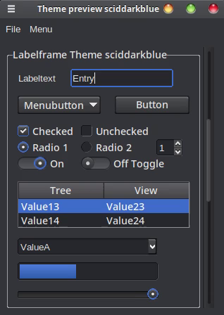 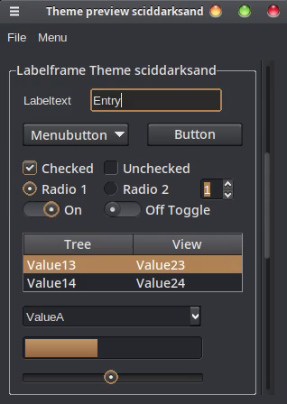

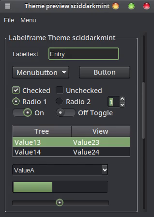 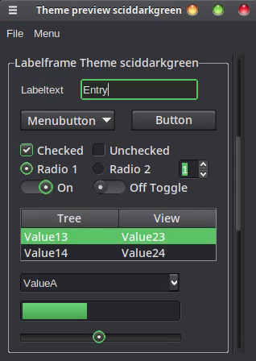

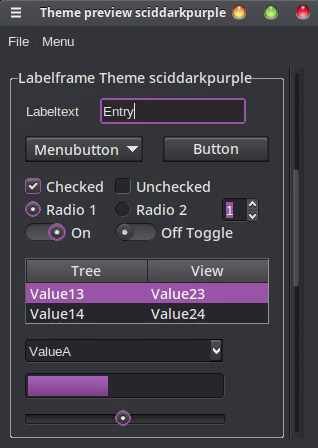 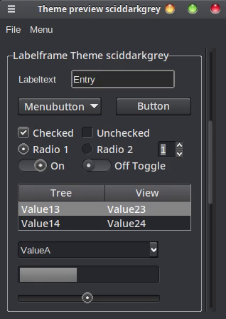

## Preview Lite Themes
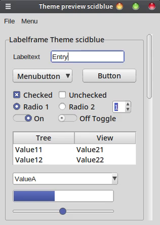 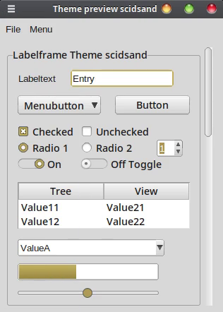

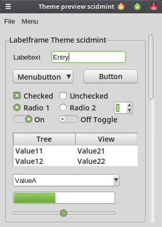 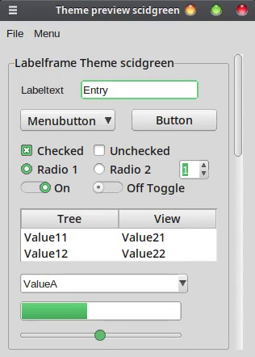

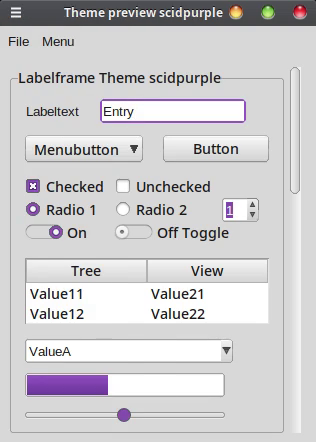 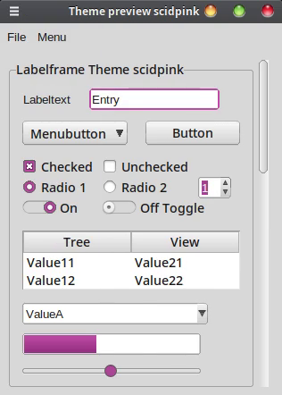

Copyright (C) 2023 Uwe Klimmek
Available under the BSD-like 2-clause Tcl License as described in LICENSE in this folder
